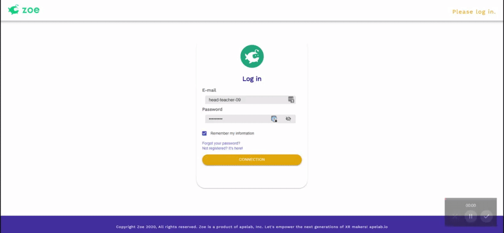
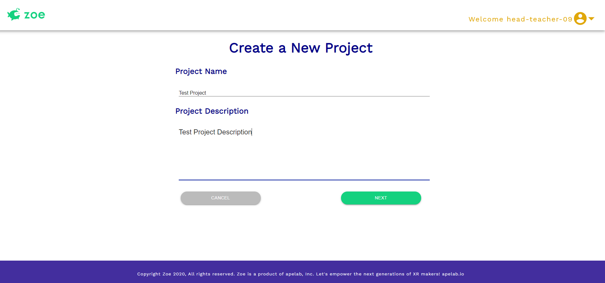
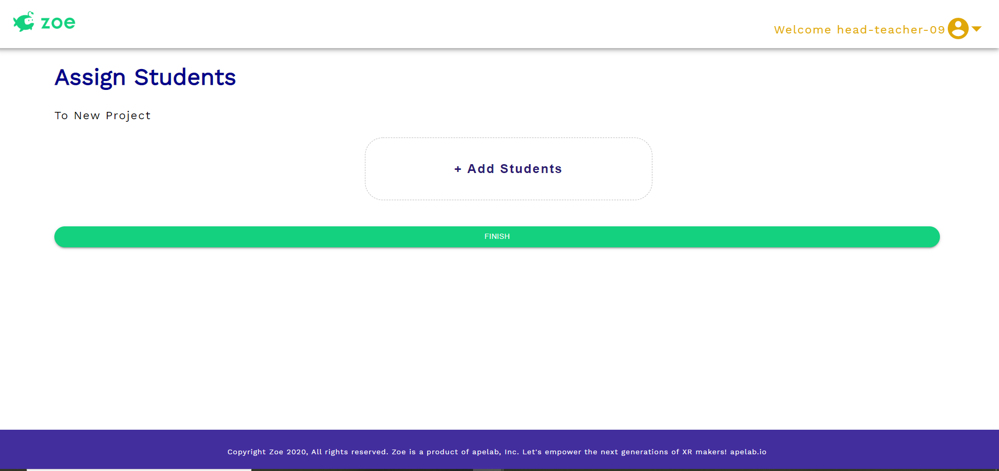
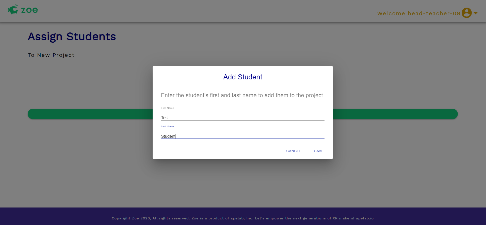
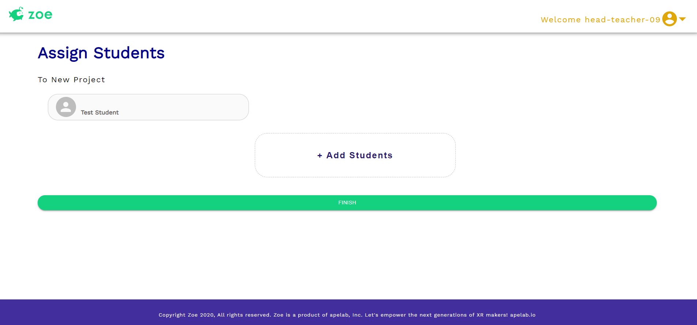
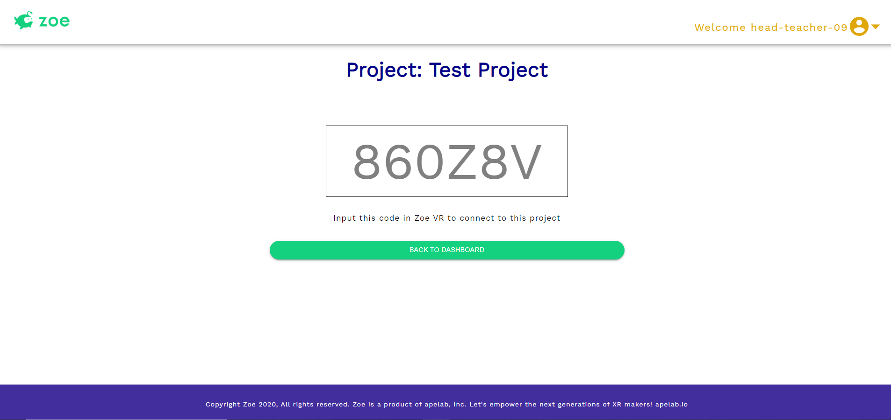
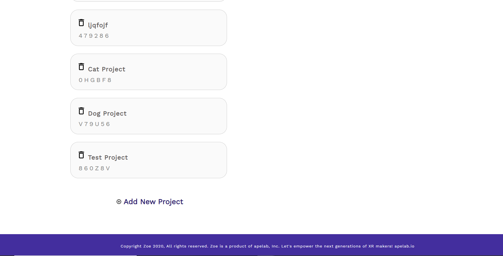
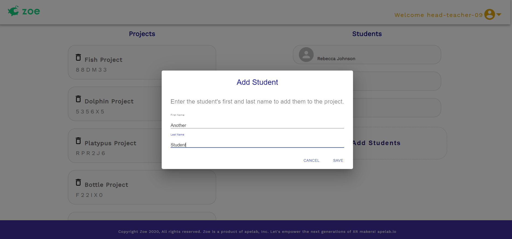
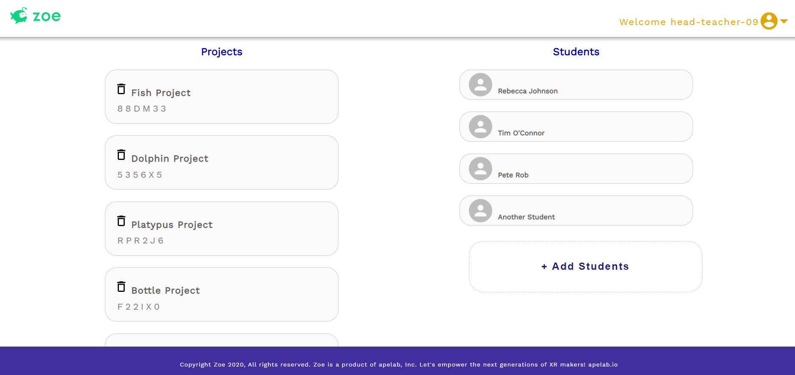

# Zoe Project

## Description

Zoe is a web platform for schools and educators to teach coding, creation and 3D using Virtual and Augmented Reality (VR & AR). The platform contains various elements: A Website, A VR app (developed in the Unity Game Engine) and a plugin for Unity the students can use at school to visually program experiences.

We have created a standalone web app which will be connected to the Zoe VR App. This website is independent from the current Wordpress website for now but the structure will allow it to evolve so we could link the two together in the future. 

The flow for the user interface starts off with a log-in screen for user (teachers) authorization, a page to view existing user projects, a page to create a new project, a page to generate a unique code that grants students access to the project in Unity, and a dashboard page for teachers to view all created projects.

The link to the live application can be found here.

## Technology 

- React
- Material UI
- Reach Router
- Wordpress database plugins to retrieve existing data
- JWT Authorization Plugin
- MongoDB to store application data to send to Unity
- Express
- NodeJS
- GitHub for version control
- Clubhouse for project management

## Demo

The teacher starts off by logging into the application. The homepage is a dashboard that shows all the projects they have created and a list of all the students in the class. They can create a project and add a student to the class from this page.

When they click on the button to create a new project, they are redirected to a page where they enter in the project name and project description. 

After entering the necessary information, the teacher clicks on next and has the ability to add new students to the project. They can add as many students as they want from this page. New students will show up on the page as they are added.

Once they have added the students, the teacher clicks on finish. This directs them to see the page with the project code that was generated. 

The teacher can then click on the button that brings them back to the dashboard. The new project is added to the end of the list.

The teacher can also add students to the class from the dashboard. They click on the button to add students, then enter the first and last name of the student. Once the information is saved the new student gets added to the list of students on the dashboard.
 

## Future Developments

- Delete functionality for projects and students
- Update functionality for projects and students
- Logic to ensure project code is unique
- Register component
- Display project description and students associated with a project

## Contributors

- @stephmarie17
- @alexandramj92
- @prydell

